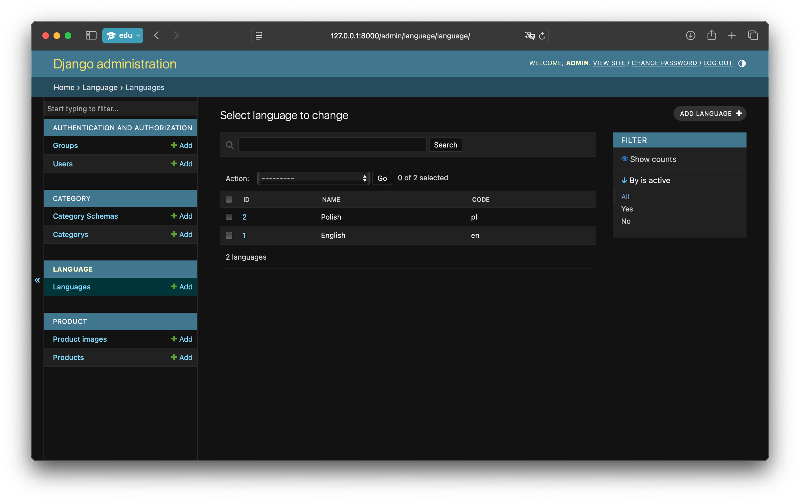
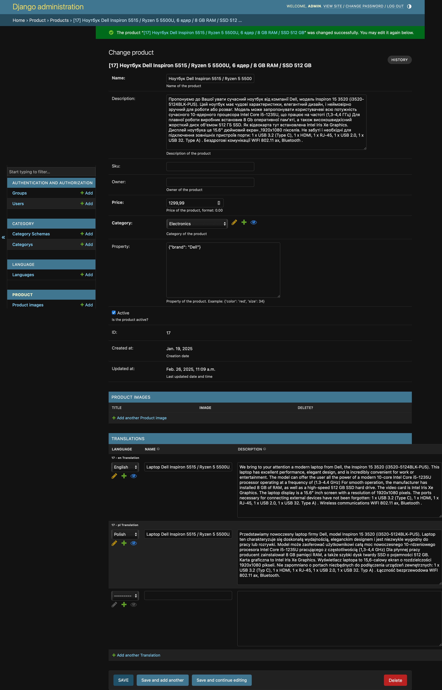
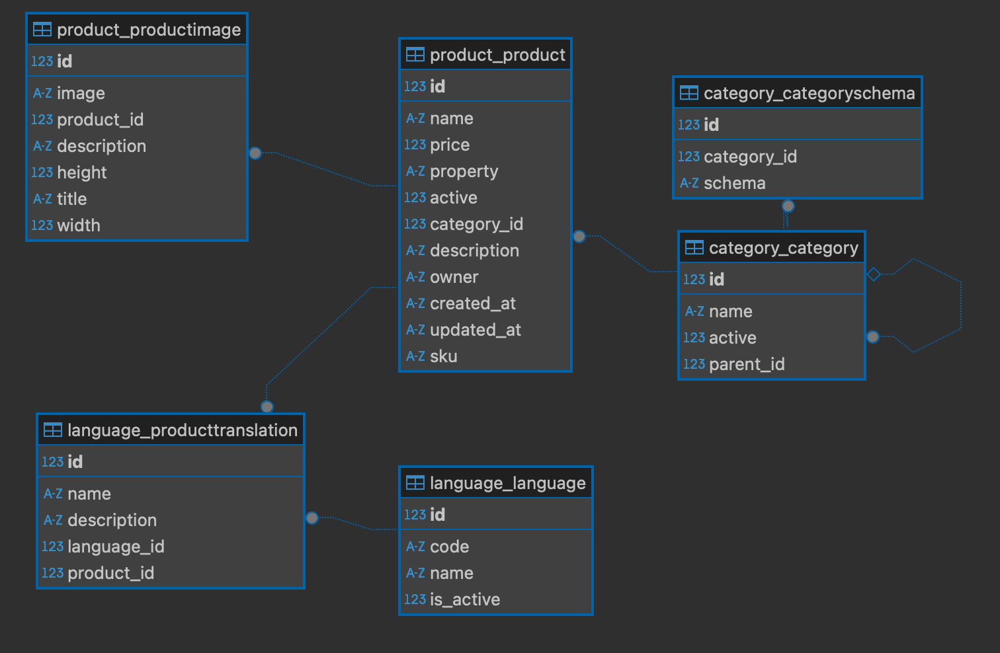
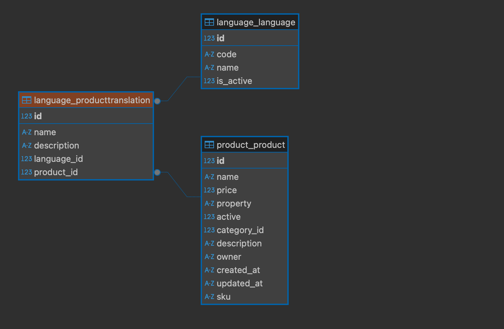
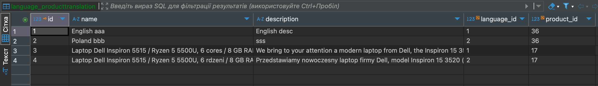

# Languages

Вебсайт має основну мову за змовчуванням, інші мови додаються через панель адміністратора.
А у продуктах можна вказати безпосередньо додаткові переклади текстів на інші мови.
Якщо не має перекладу буде застосована мова за змовчуванням.

## ProductTranslation 
### Translated fields:
- `name` - назва продукту
- `description` - опис продукту
- `translation` - переклад тексту на іншу мову, як посилання на `ProductTranslation`

### Admin Product Translation:

## DB Diagram Translations

### CategoryTranslation

### CategorySchemaTranslation

### App language
- models: 
  - `Language`
  - `ProductTranslation`
  - `CategoryTranslation`
  - `CategorySchemaTranslation`
- serializers: `ProductTranslationSerializer`
- admin: `LanguageAdmin`